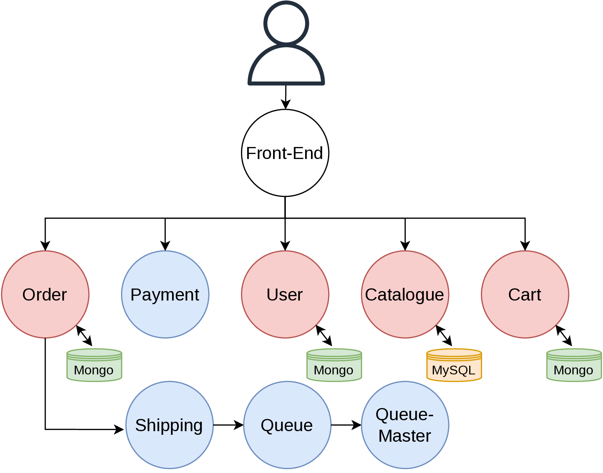

# AISE_Sockshop

The purpose of this tutorial is to provide a brief introduction to microservices, with a particular focus on their deployment. Specifically, we will deploy the [SockShop](https://github.com/microservices-demo/microservices-demo) application locally. **SockShop** is a well-known microservices-based benchmarking application. The deployment will be carried out using [Docker](https://www.docker.com/) and [Kubernetes](https://kubernetes.io/). In addition, this tutorial will include a short background on these tools to help contextualize the process.

## Microservices

Microservices are an **architectural style** for building applications as a collection of small, independent services that work together. Each service is designed to perform a **specific function**, and they communicate with each other through lightweight mechanisms such as **HTTP APIs** or **messaging systems**.

### Key Characteristics
- **Independence**: Each microservice can be developed, deployed, and scaled independently.  
- **Specialization**: A microservice is focused on solving a single business capability.  
- **Communication**: Services interact through well-defined interfaces, often using REST, gRPC, or message queues.  
- **Resilience**: The failure of one service does not necessarily bring down the whole system.  
- **Technology Flexibility**: Different microservices can be built using different programming languages, frameworks, or databases.  

### Advantages
- **Scalability**: Only the services under heavy load need to be scaled.  
- **Faster Development**: Teams can work on different services in parallel.  
- **Flexibility in Technology**: Teams can choose the best technology for each service.  
- **Improved Fault Isolation**: Failures are contained within a single service.  

## SockShop

The application is the user-facing part of an online shop that sells socks.




In this architecture, the functionalities of the application are decomposed into distinct components, ensuring the **independence** and the **specializzation** of the microservices.
. Each microservice is responsible for a specific function. For example, the *Order* service manages customer orders, while the *User* service handles authentication, and so on.  

Another important aspect to highlight is the **decentralization of data**: the *Order*, *User*, *Cart*, and *Catalogue* services each maintain their own dedicated database (using MongoDB or MySQL), ensuring data ownership and independence across services.

The microservices highlighted in red in the image are referred to as **edge services**, as they expose REST APIs. These services act as entry points, allowing external requests to be sent directly to them. In this way, the frontend application interacts with the system by consuming these APIs to render and manage the web interface.

....

## Deploy with Docker compose

## Introduction to Docker

**Docker** is an open-source platform designed to simplify the process of building, deploying, and running applications. It enables developers to package an application and its dependencies into a standardized unit called a **container**. Containers are lightweight, portable, and consistent across different environments, ensuring that an application behaves the same way in development, testing, and production.

### Why Docker?

Traditionally, deploying an application required setting up servers, installing dependencies, and ensuring that configurations matched across environments. This often led to the classic issue of *"it works on my machine, but not in production."* Docker addresses this problem by isolating applications inside containers that run independently of the host system’s configuration.

### Key Features

- **Portability:** Containers can run on any system that has Docker installed, regardless of the underlying OS.  
- **Isolation:** Each container runs in its own environment, independent from others.  
- **Lightweight:** Containers share the host system’s kernel, making them more efficient than virtual machines.  
- **Scalability:** Containers can be easily replicated and orchestrated, which is essential for modern distributed applications.  

### Docker in Practice

With Docker, developers can:  
- Create container images that package their code with the required dependencies.  
- Run these images consistently across local machines, servers, or cloud environments.  
- Use tools like **Docker Compose** to manage multi-container applications.  

### Dockerfile

A **Dockerfile** is a text file that contains a set of instructions to build a Docker image. It defines the environment, dependencies, and steps required to package an application into a container. Using a Dockerfile ensures that the application can be built and run consistently across different environments.

### Key Concepts

- **FROM:** Specifies the base image to use (e.g., an official Python or Node.js image).  
- **RUN:** Executes commands in the container during the build process, such as installing packages.  
- **COPY / ADD:** Copies files from the host system into the image.  
- **WORKDIR:** Sets the working directory inside the container.  
- **CMD / ENTRYPOINT:** Defines the command to run when the container starts.  
- **EXPOSE:** Indicates the ports the container will listen on.


## Simple Dockerfile Example

This is a minimal Dockerfile that runs a basic Python application:

```dockerfile
# Use the official Python base image
FROM python:3.11-slim

# Set the working directory inside the container
WORKDIR /app

# Copy the application file into the container
COPY app.py .

# Run the application
CMD ["python", "app.py"]
```


The app.py can contains all you want, for example a simple Hello World code.

```
print('Hello World')
```

```
docker build -t my-python-app .
docker run my-python-app
```

This is the ouput

PUT IMAGE


## Deploy SockShop with Docker

Deploy of SOckshop...

If you want to try, jump to the [Sending request section]
## Deploy with Kubernetes

Kubernetes is ....

YAML ....
    Service...
    POD...
    Replica...

Deploy.....


## Sending Requests

Exploiting the openapi specs we can send the requests

curl...
postman..

# Notes

This repo contains the code of [SockShop original repo](https://github.com/microservices-demo/microservices-demo)